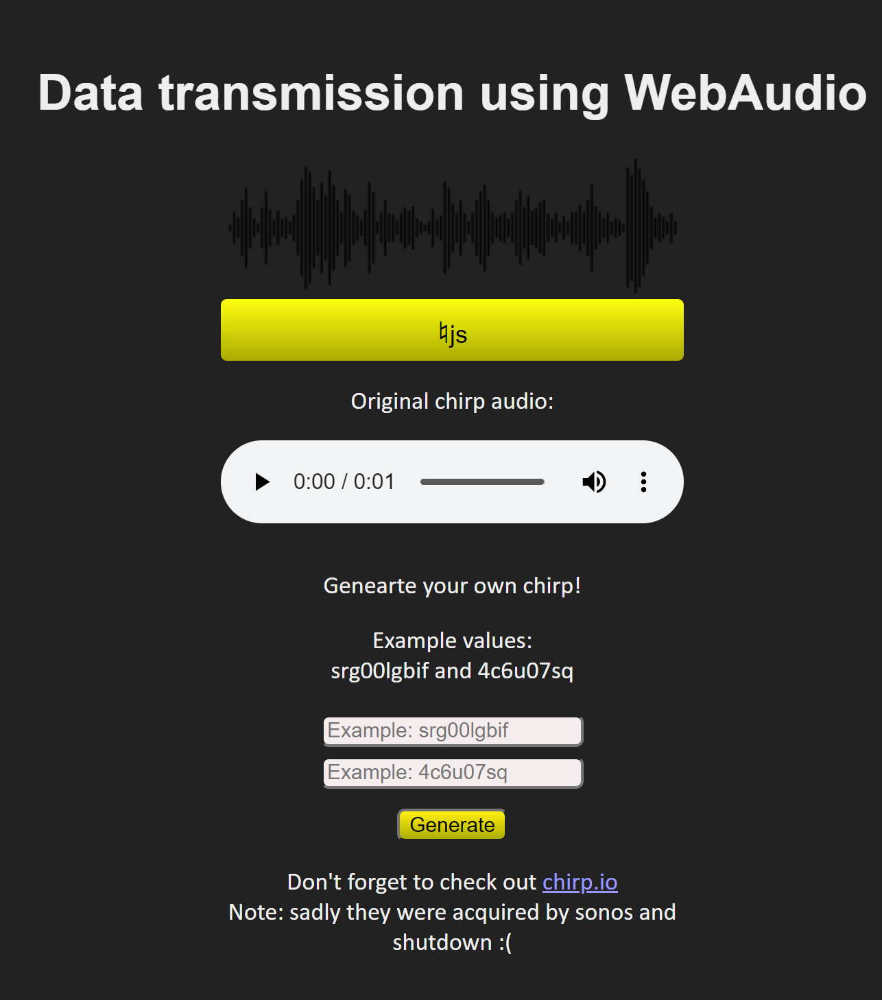

Chirp chirp
===========
[](https://github.com/ricardobeat/chirpweb/contributors)
[](https://github.com/ricardobeat/chirpweb/issues)

## created by ricardobeat

### This is an attempt to implement the chirp.io protocol ([http://chirp.io/tech/](https://web.archive.org/web/20121020144938/http://chirp.io/tech/)) using the WebAudio API.

Currently it can generate the tones and successfully send data to a chirp receiver,
but only using pre-generated message data from chirp.io.

For creating messages a 5-bit Reed-Solomon error correction implementation is needed,
plus guessing all the encoding parameters.

See demo at http://ricardobeat.github.com/chirpweb

# Quick start with prebuilt docker image
```bash
docker run -it --rm -p 80:80 wisehackermonkey/chirpweb:latest
```

# Run with docker
```bash
cd /path/to/repo
docker build -t chirpweb:latest .
docker run -it -p 80:80 chirpweb:latest
```

# docker compose
```bash
cd /path/to/repo
docker-compose build
docker-compose up
```

# Development
## build and push docker container to registry
```bash
cd /path/to/repo
docker build -t wisehackermonkey/chirpweb:latest .
docker login
docker push wisehackermonkey/chirpweb:latest
```
# Open in broswer
```bash
localhost:80
```

# Contributors
[](https://github.com/ricardobeat/chirpweb/graphs/contributors)

Made with [contributors-img](https://contrib.rocks).
